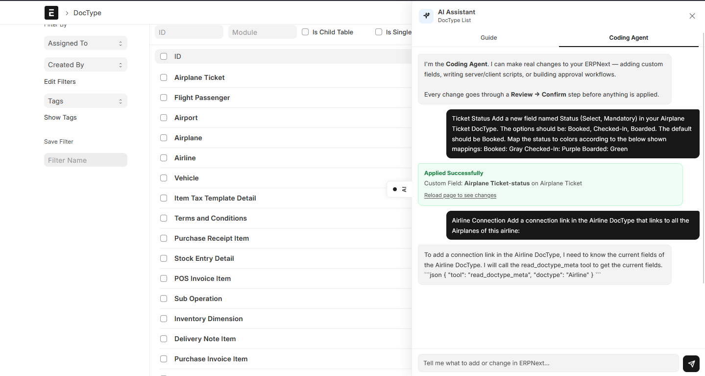

# Frappe AI Assistant

An AI-powered assistant embedded natively inside ERPNext as a Frappe custom app. It lives as a resizable sidebar on every page — no tab switching, no separate tools.

Built in two phases: a **Guide Agent** that teaches ERPNext to non-technical users, and a **Coding Agent** that makes real, validated changes to the system from plain English prompts.



---

## What It Does

### Guide Agent
Answers any question about ERPNext in plain language. Knows what page you are on and gives context-aware answers and suggestions. Explains DocTypes, workflows, permissions, scripts, and any ERPNext concept without requiring technical knowledge.

### Coding Agent
Turns plain English into real ERPNext customizations — with a mandatory preview and confirm step before anything touches the database.

**The flow:**
```
You type a request
      ↓
Groq (Llama 3.3-70b) decides which tool to call
      ↓
Pydantic validates every argument
      ↓
Blue preview card — you see exactly what will be created
      ↓
You click "Apply Changes"
      ↓
Change written to ERPNext
      ↓
Green success card with "Undo this change" button
```

Nothing touches the database until you confirm.

---

## What the Coding Agent Can Create

| Feature | Description |
|---|---|
| Custom Field | Add a field to any existing DocType — Customer, Sales Invoice, Employee, etc. |
| New DocType | Brand new form and database table with full field support |
| Server Script | Python that runs on document events — Before Save, After Save, On Submit, etc. |
| Client Script | JavaScript that runs in the browser on form load or field change |
| Workflow | Multi-stage approval process with states, transitions, and role-based access |
| Records | Insert documents into any existing DocType |

---

## Safety

All of the following are hardcoded and cannot be bypassed:

- **Banned DocTypes** — refuses to touch: `User`, `Role`, `DocType`, `DocField`, `Has Role`, `DocPerm`, `Module Def`, `Patch Log`, `DefaultValue`
- **System Manager required** — regular users cannot trigger any write action
- **5-minute expiry** — staged changes expire if not confirmed within 5 minutes (stored in Redis with TTL)
- **One action per confirm** — every tool call is a separate preview and confirm cycle
- **Pydantic validation** — every input validated before reaching the database
- **Script keyword blocking** — server and client scripts scanned for dangerous keywords before preview

---

## Change Log and Rollback

Every applied change is written to the `AI Change Log` DocType with:
- Who made the change and when
- Full JSON payload of what was created
- Rollback payload with enough information to delete it

The **Undo this change** button calls `rollback()` — deletes the created record and marks the log as Rolled Back.

---

## Tech Stack

| Layer | Technology |
|---|---|
| Framework | Frappe v15 / ERPNext v15 |
| LLM | Groq API — Llama 3.3-70b-versatile |
| Tool Calling | Groq OpenAI-compatible function calling |
| Validation | Pydantic v2 |
| Frontend | Vanilla JavaScript injected via `app_include_js` hook |
| Session State | Frappe session + Redis |
| Change Log | Custom Frappe DocType |

---

## Architecture

```
frappe_ai_assistant/
├── public/js/
│   └── ai_sidebar.js        ← entire frontend — injected into every ERPNext page
├── api/
│   ├── guide.py             ← Guide Agent — Groq chat with context awareness
│   ├── coding_agent.py      ← Coding Agent — Groq tool calling loop
│   ├── tools.py             ← Frappe API functions (create field, script, workflow)
│   ├── safety.py            ← Pydantic models + blocked DocType enforcement
│   └── rollback.py          ← Change log + undo functions
└── doctype/
    └── ai_change_log/       ← Audit trail DocType
```

**How the sidebar gets into ERPNext:**

One line in `hooks.py`:
```python
app_include_js = "/assets/frappe_ai_assistant/js/ai_sidebar.js"
```

Frappe loads this on every page. The JS reads `frappe.cur_frm` and `frappe.get_route()` to know exactly what the user is looking at.

---

## Context Detection

The sidebar knows what page you are on at all times:

```javascript
// On a form
frappe.cur_frm.doctype  // "Customer"
frappe.cur_frm.docname  // "Mehta Traders Pvt Ltd"

// On a list view
frappe.get_route()  // ["List", "Stock Entry", "List"]
// → extracted as listDoctype = "Stock Entry"

// On a report
frappe.get_route()  // ["query-report", "General Ledger"]
```

This context is injected as a prefix into every LLM message:
```
[Context: I am on the Customer List page in ERPNext] what is this page?
```

---

## Installation

**Requirements:**
- Frappe v15 bench
- ERPNext v15
- Groq API key (free at console.groq.com)

**Steps:**

```bash
# Get the app
bench get-app https://github.com/yourusername/frappe_ai_assistant

# Install on your site
bench --site yoursite.localhost install-app frappe_ai_assistant

# Run migrations (creates AI Change Log table)
bench --site yoursite.localhost migrate

# Install Python dependency
./env/bin/pip install groq

# Build assets
bench build --app frappe_ai_assistant

# Restart
bench restart
```

**Add your Groq API key to site_config.json:**
```json
{
  "groq_api_key": "gsk_your_key_here"
}
```

---

## Usage

1. Open any page in ERPNext
2. Click the **AI** pill on the right edge of the screen
3. Use **Guide tab** to ask questions about ERPNext
4. Use **Coding Agent tab** to make customizations

**Example prompts for the Coding Agent:**
```
Add a WhatsApp number field to the Customer form
Create a server script that validates GSTIN on Customer save
Add an approval workflow to Purchase Orders
Create a new DocType called Vehicle with fields for registration and model
```

---

## Limitations

| Cannot | Why |
|---|---|
| Edit or delete existing fields or scripts | Only creates new things |
| Search or read your business data | No read/query tools |
| Create Print Formats, Email Templates, Reports | Not yet implemented |
| Chain two writes in one confirm | Each tool call is a separate flow |

---

## Roadmap

- [ ] Edit and delete existing customizations
- [ ] Print Format generation
- [ ] Email Template creation
- [ ] Query tool — read and summarize business data
- [ ] Multi-step workflows in a single conversation
- [ ] Support for Claude and OpenAI alongside Groq

---

## License

MIT